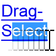

## Drag-Select Link Text
Firefox Web Extension.
[Available on AMO](https://addons.mozilla.org/en-US/firefox/addon/drag-select-link-text/)

**Select link text with easy mouse gestures.**

Selecting link text has never been so easy! Don't fumble trying to select 
text inside links from the outside edges, using trial and error to get the 
right cursor placement and making unwanted selections. Don't struggle with 
the Alt key only to click the link by accident or trigger the menubar. Just 
do a simple mouse drag gesture on the link exactly where you want selection 
to start.

Three different types of gestures are available:

* **Horizontal** - Select text by dragging horizontally (similar to Opera 12).
* **Hold** - Select text by waiting for the hold time to elapse before dragging.
* **Immediate** - Select text by immediately dragging before the hold time elapses.

If selection is not started when leaving the drag threshold then the link 
will be dragged instead like it would normally. The length of the hold time 
is adjustable (default 0.3 seconds) and when it elapses the cursor changes so 
you know when to start dragging. Hold for longer (default 1 second) to 
automatically select all of the link's text. Hold Ctrl/Shift/Meta modifier 
key to always do selection.

Full compatibility with Firefox's multi-selection feature.

Make selections in clickable areas without triggering a click.

Advanced option available to override the CSS rule that prevents text 
selection, note that pseudo-elements still cannot be selected ([Bug 
12460](https://bugzilla.mozilla.org/show_bug.cgi?id=12460)).

Doesn't work with middle-click paste on Linux due to [Bug 
1015877](https://bugzilla.mozilla.org/show_bug.cgi?id=1015877). 

Official Firefox support for the horizontal selection gesture is tracked by 
[Bug 378775](https://bugzilla.mozilla.org/show_bug.cgi?id=378775).
